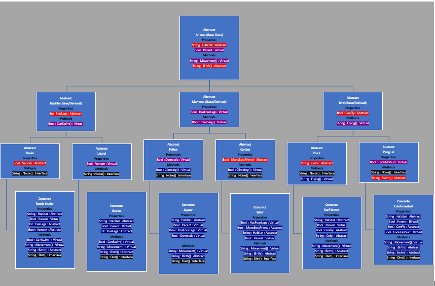

<h1> Zoo </h1>

<h2> Summary </h2>

The Zoo project is a wide spread project built to allow us to sharpen our minds when mapping out our idea for organization
in regards to class inheritance.  We also got to practice communicating and linking classes to one another, how to engage with 
inherited properties or methods. 

<h2> Mapping </h2>

<h2> OOP Principles </h2>

Abstract: is a feature, when working within a class, that stats that any concrete thing that derives from this
 class must have this method or property and you must define it per the situation. In regards to the class itself 
abstract means you dont have enough information with this class to be a thing, you must be more specific.
-All my classes were abstract until the last 6 because in all the cases they are to generic, needed to specify more. 
An example of a abstract proptery and method is in Animal I use Habitat and Birth.  All living animals have a natural habitat
and give birth just in different places and different ways.  So each concrete class needs to define those things to the 
classes specifcally.

Inheritance: is just what it sounds like.  I parent class passes down its properties and methods for example to any classes derived from it.
-All my abstract classes pass down properties and methods from Animal class to mammal to feline to the jaguar for example.  So all Concrete
 animals will end up with the properties and methods from its parents, parents parents, to their parents parents parent.

Polymorphism: is a method to have the ability to restructor what it does does are what a properties value might be for example, that might have been 
assigned in a prior parent.  While it inherits the method from the parent it can override it to change its value or what it does.
-In my zoo I demonsrtate this with virtual properties and methods.  In some situations I assign it a value when it was written, and others I planned
 on giving it a different value but only in certian situations.  For example is in the abstract Lizard class I set a property called Venom as virtual 
I did this because I know most lizards arnt venomous however in some situations they are, so I want that ability to be flexable and change the value 
to true in the case that it is venomous.

Encapsulation: while I only really used public in my project, I understand the importance of it and how It can be used.  This sets a property to 
either private, public, or protected.  private makes it so only properties and methods within the class can see it, while public allows everything/everyone 
can see it.  Protected I tried to use but I ran into some issues, from my understanding right now protected give a little of both private and public. 
What I mean by that is nothing outside of the class and any classes derived from the class with the protected property or method have can see it.  
-I only use public In my project as I wanted everything to be able to see one another to pass down everything with inheritance.  I tried throwing 
all my abstract classes as protected as I just want them to pass down I dont need its parents to see its childrens stuff.  However I was getting some 
red lines I couldnt figure out what it was telling em.

Interface: are how we can pass in multiple things through inheritance without the issues that passing in multiple classes may bring.  How it does this 
is in the Interface doesnt actually set a property value, or a method does.  By doing this it allows us to take inheritance from One Base class and many Interfaces. 
-In my project I utilized this with two methods.  Diet method and a noise method.  

<h2> Setup: </h2>

-Open VS community  
-Create new project  
-Go to File  
-New  
-New Project  
-In the window on the left you will see a .NET Core option under Visual C# make sure you have that selected  
-Now in the middle section select Console App (.NET Core)  
-Next in the bottom change the name to your choice and change path if you want and then click "Ok"  
-Next click view  
-Then Solution Explorer  
-If it wasnt already there it will open a tab on the right side showing your Solution Explorer  
-Next click on the tiny folder tab in the Solution explorer tab the change to Solution Explorer - Folder View  
-Navigate to Program.cs file and double click to open it  
-Once you have that open copy and paste the source code below into the Program.cs file  
-Hit control S to save the source code you pasted into your file  
-Now go back up to the Solution Explorer - Folder View and hit the little folder tab to change back to the just the Solution Explorer  
-Now its time to run the code in the top nav bar hit Debug  
-Then Click Start Debug to see all the animals talk!  